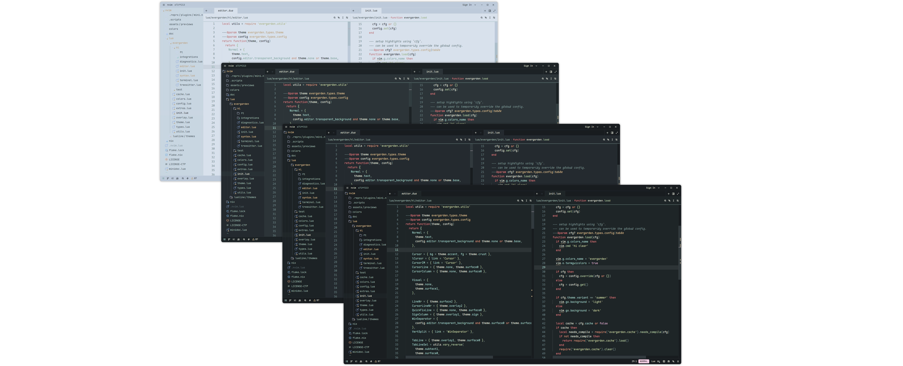
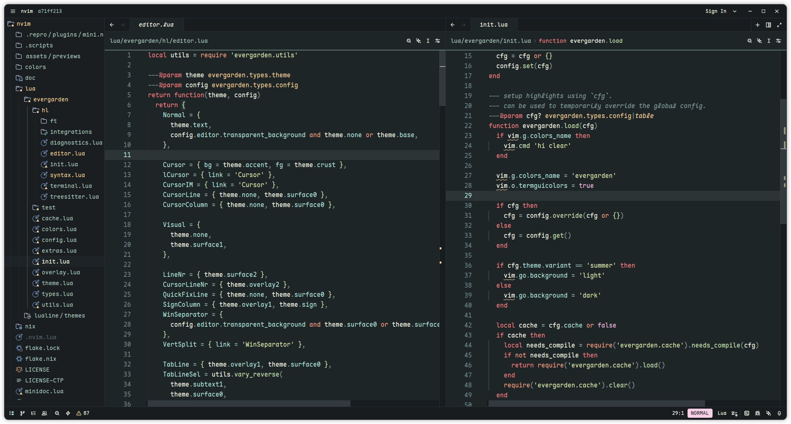
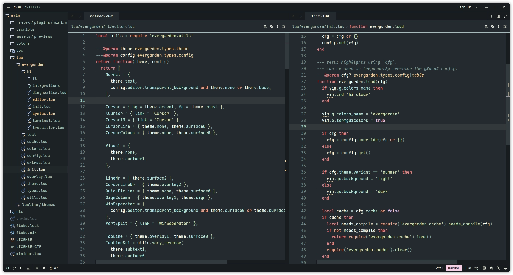
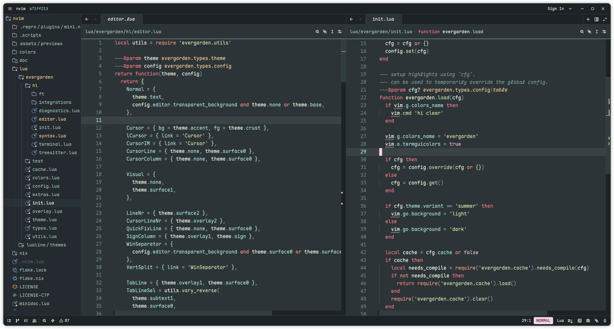
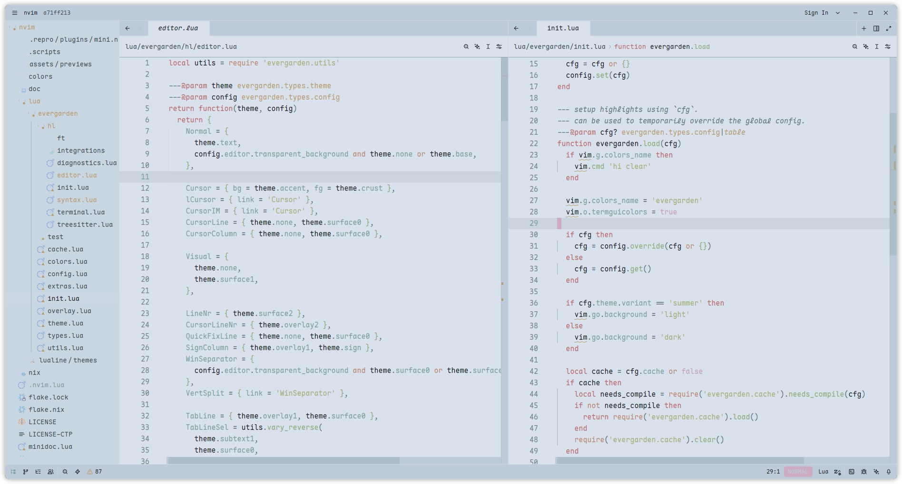

<h3 align="center">
   
  Evergarden for <a href="https://zed.dev">Zed</a>
</h3>

  
  
  

  

### Previews

  
Winter

  

  
Fall

  

  
Spring

  

  
Summer

  

### Usage

1. Download your favourite accent from the `themes/` folder.
1. Move the file to `~/.config/zed/themes`.
1. Open the command palette (<kbd>Ctrl+Shift+p</kbd>) in zed, use `theme
   selector: toggle` and select your variant.

### Thanks to <3

- [comfysage](https://codeberg.org/comfysage)
- [catppuccin](https://github.com/catppuccin/zed)

  

